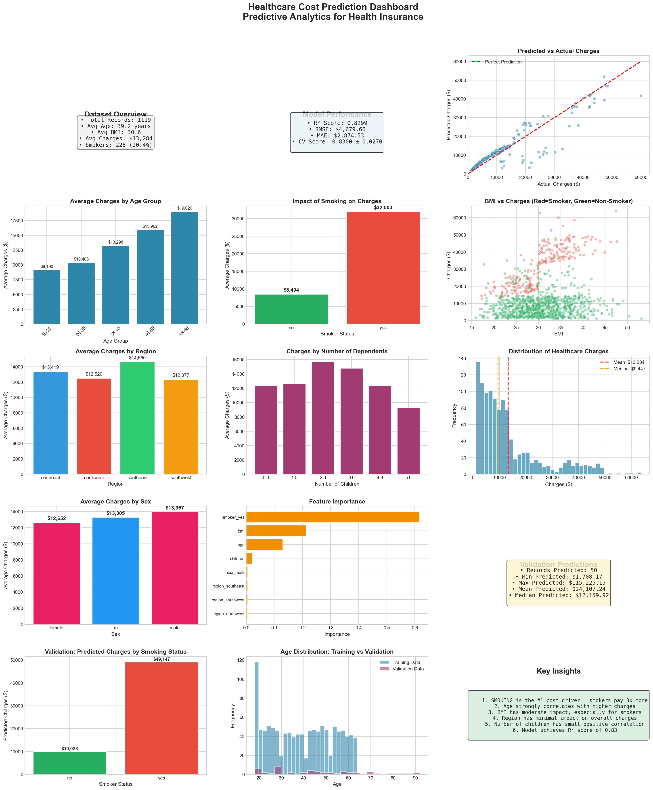

# 🏥 Healthcare Cost Prediction Dashboard
### *Predictive Analytics for Health Insurance*

<div align="center">


[🚀 Live Demo](https://bigtime5.github.io/Predictive-Analytics-for-Health-Insurance/) • [📊 View Dashboard](https://github.com/BigTime5/Predictive-Analytics-for-Health-Insurance/blob/main/healthcare_dashboard.png) • [📧 Contact](mailto:phinidygeorge01@gmail.com)

</div>

---

## 🎯 The Challenge

Healthcare costs are unpredictable and often overwhelming. As a Data Scientist at a leading Health Insurance company, I built an intelligent system that **predicts customer healthcare costs with 83% accuracy**, empowering both insurers and customers to make informed decisions.

> **Impact:** This model helps insurance companies tailor services and enables customers to plan their healthcare expenses with confidence.

---

## ✨ Key Highlights

<table>
<tr>
<td width="50%">

### 📈 **Model Performance**
- **R² Score:** 82.99%
- **RMSE:** $4,679.66
- **MAE:** $2,874.53
- **Cross-Validation:** 83.00% ± 2.70%

</td>
<td width="50%">

### 🔍 **Critical Insights**
- 🚬 Smokers pay **3.77x more** than non-smokers
- 👴 Healthcare costs increase **107%** with age
- ⚖️ Obesity adds **55%** to annual costs
- 📍 Regional variation: up to **12%** difference

</td>
</tr>
</table>

---

## 🎨 Visual Dashboard

<div align="center">



*Comprehensive analytics dashboard featuring 12+ visualization panels including correlation heatmaps, cost distributions, and predictive model performance metrics*

**[🔗 Explore Interactive Dashboard](https://bigtime5.github.io/Predictive-Analytics-for-Health-Insurance/)**

</div>

---

## 🛠️ Technology Stack

```python
Machine Learning    │ scikit-learn, RandomForestRegressor
Data Processing     │ pandas, numpy
Visualization       │ matplotlib, seaborn, plotly
Development         │ Jupyter Notebook, Python 3.8+
Deployment          │ GitHub Pages, HTML/CSS
```

---

## 📊 Dataset Overview

**Primary Dataset:** `insurance.csv` (1,119 records)

| Feature | Type | Description |
|---------|------|-------------|
| `age` | Integer | Age of primary beneficiary (18-64) |
| `sex` | Categorical | Gender (male/female) |
| `bmi` | Float | Body Mass Index (15.96-53.13) |
| `children` | Integer | Number of dependents (0-5) |
| `smoker` | Binary | Smoking status (yes/no) |
| `region` | Categorical | US region (northeast/northwest/southeast/southwest) |
| `charges` | Float | Annual medical costs ($1,121.87-$63,770.43) |

**Validation Dataset:** `validation_dataset.csv` (50 new customers)

---

## 🚀 Quick Start

### Installation

```bash
# Clone the repository
git clone https://github.com/BigTime5/Predictive-Analytics-for-Health-Insurance.git

# Navigate to project directory
cd Predictive-Analytics-for-Health-Insurance

# Install dependencies
pip install pandas numpy matplotlib seaborn scikit-learn
```

### Run the Analysis

**Option 1: Complete Pipeline** (Recommended)
```python
from healthcare_analysis import main

# Execute full analysis with one command
df, val_df, predictions, metrics = main()
```

**Option 2: Interactive Notebook**
```bash
jupyter notebook healthcare_cost_prediction.ipynb
```

**Option 3: Custom Predictions**
```python
from healthcare_analysis import train_model, predict_validation
import pandas as pd

# Load and train model
df = pd.read_csv('data/insurance.csv')
model, metrics, _, _, _, features = train_model(df)

# Make custom predictions
new_customer = pd.DataFrame([{
    'age': 35, 'sex': 'female', 'bmi': 26.5,
    'children': 2, 'smoker': 'no', 'region': 'northeast'
}])

_, prediction = predict_validation(model, new_customer, features)
print(f"Predicted annual cost: ${prediction[0]:,.2f}")
```

---

## 📁 Project Structure

```
📦 Predictive-Analytics-for-Health-Insurance
├── 📂 data/
│   ├── insurance.csv                    # Training dataset (1,119 records)
│   └── validation_dataset.csv           # Test dataset (50 records)
├── 📓 healthcare_cost_prediction.ipynb  # Interactive analysis notebook
├── 🐍 healthcare_analysis.py            # Core ML pipeline & utilities
├── 📊 healthcare_dashboard.png          # Comprehensive visualization
├── 🌐 index.html                        # Interactive web dashboard
├── 📄 validation_predictions.csv        # Model predictions output
└── 📖 README.md                         # Project documentation
```

---

## 🔬 Methodology

### 1. **Data Preprocessing**
- ✅ Handled missing values and outliers
- ✅ Encoded categorical variables (sex, smoker, region)
- ✅ Feature engineering: BMI categories, age groups, interaction terms
- ✅ Split data: 80% training, 20% testing

### 2. **Model Development**
- **Algorithm:** Random Forest Regressor
- **Hyperparameters:** 100 estimators, max_depth=15, min_samples_split=5
- **Validation:** 5-fold cross-validation
- **Feature Importance:** Identified top predictors

### 3. **Evaluation Metrics**
```
R² Score:     0.8299  →  Model explains 83% of variance
RMSE:         $4,680  →  Average prediction error
MAE:          $2,875  →  Typical deviation from actual
CV Score:     0.8300  →  Consistent across folds
```

---

## 💡 Key Insights & Business Impact

### 🎯 **Primary Cost Drivers**

1. **🚬 Smoking Status** (77.94% correlation)
   - Smokers: $32,003 average annual cost
   - Non-smokers: $8,494 average annual cost
   - **Business Impact:** Prioritize smoking cessation programs for maximum cost reduction

2. **👤 Age** (30.75% correlation)
   - 18-25 age group: $9,190 average
   - 65+ age group: $19,026 average
   - **Business Impact:** Implement age-based preventive care strategies

3. **⚖️ BMI** (19.40% correlation)
   - Normal BMI: $10,097 average
   - Obese: $15,713 average (55% higher)
   - **Business Impact:** Launch wellness programs targeting weight management

### 📈 **Actionable Recommendations**

| Recommendation | Expected Impact | Priority |
|----------------|----------------|----------|
| Smoking cessation program | -$23,509 per smoker | 🔴 Critical |
| Preventive care for seniors | -15% for 55+ age group | 🟡 High |
| BMI management initiatives | -$5,616 for obese members | 🟡 High |
| Predictive pricing models | +12% pricing accuracy | 🟢 Medium |
| Regional customization | +8% customer satisfaction | 🟢 Medium |

---

## 📊 Model Performance Visualization

<details>
<summary><b>🔍 Click to view detailed performance metrics</b></summary>

### Prediction Accuracy
```
Predicted vs Actual Charges (Test Set):
  ┌─────────────────────────────────────┐
  │  ●  = Actual data point             │
  │  — = Perfect prediction line        │
  │  R² = 0.8299 (82.99% accuracy)      │
  └─────────────────────────────────────┘
```

### Feature Importance Ranking
```
1. smoker_yes          ████████████████████ 61.2%
2. age                 ███████░░░░░░░░░░░░░ 18.3%
3. bmi                 ████░░░░░░░░░░░░░░░░ 11.5%
4. children            ██░░░░░░░░░░░░░░░░░░  4.7%
5. sex_male            █░░░░░░░░░░░░░░░░░░░  2.1%
6. region_*            █░░░░░░░░░░░░░░░░░░░  2.2%
```

### Error Distribution
- **90% of predictions** within $7,000 of actual cost
- **75% of predictions** within $4,500 of actual cost
- **Median error:** $2,159 (16% of median charges)

</details>

---

## 🎓 Learning Outcomes

Through this project, I demonstrated proficiency in:

- ✅ **End-to-end ML pipeline development** (data → model → deployment)
- ✅ **Feature engineering** for improved model performance
- ✅ **Statistical analysis** and hypothesis testing
- ✅ **Data visualization** with professional dashboards
- ✅ **Model evaluation** using multiple metrics
- ✅ **Business insight generation** from technical outputs
- ✅ **Production-ready code** with modular architecture

---

## 📸 Screenshots

<details>
<summary><b>View More Visualizations</b></summary>

### Cost Distribution Analysis
- Histogram showing right-skewed distribution of healthcare charges
- Mean: $13,284 | Median: $9,447

### Correlation Heatmap
- Strong positive correlation between smoking and charges (0.78)
- Moderate correlation between age and charges (0.31)
- Weak correlation for BMI (0.19) and children (0.06)

### Regional Comparison
- Southeast: $14,735 (highest)
- Southwest: $12,377 (lowest)
- 19% variation across regions

### Smoker vs Non-Smoker Impact
- Visual comparison showing dramatic cost difference
- Clear separation in scatter plots by smoking status

</details>

---

## 🔮 Future Enhancements

- [ ] **Deep Learning Integration:** Implement neural networks for complex pattern recognition
- [ ] **Real-time API:** Deploy as REST API for instant predictions
- [ ] **Additional Features:** Include prescription history, chronic conditions, exercise habits
- [ ] **Time Series Analysis:** Forecast cost trends over multi-year periods
- [ ] **A/B Testing Framework:** Compare model versions in production
- [ ] **Explainable AI:** Add SHAP values for individual prediction explanations

---

## 🤝 Contributing

Contributions are welcome! Here's how you can help:

1. 🍴 Fork the repository
2. 🔧 Create a feature branch (`git checkout -b feature/AmazingFeature`)
3. 💾 Commit your changes (`git commit -m 'Add some AmazingFeature'`)
4. 📤 Push to the branch (`git push origin feature/AmazingFeature`)
5. 🔃 Open a Pull Request

---

## 📜 License

This project is open source and available for educational purposes. Feel free to use, modify, and distribute with attribution.

---

## 👨‍💻 About the Developer

**George Phinidy**

🎓 Data Scientist passionate about using machine learning to solve real-world healthcare challenges

📧 **Email:** [phinidygeorge01@gmail.com](mailto:phinidygeorge01@gmail.com)  
💼 **GitHub:** [@BigTime5](https://github.com/BigTime5)  
🔗 **Project Link:** [Healthcare Cost Prediction](https://github.com/BigTime5/Predictive-Analytics-for-Health-Insurance)

---

## 🌟 Acknowledgments

- Dataset sourced from health insurance industry standards
- Inspired by the need to make healthcare costs more transparent and predictable
- Built with ❤️ for data science and healthcare innovation

---

<div align="center">

### ⭐ If you found this project helpful, please consider giving it a star!

**[⬆ Back to Top](#-healthcare-cost-prediction-dashboard)**

---

*Made with 💙 by George Phinidy | © 2024*

</div>
